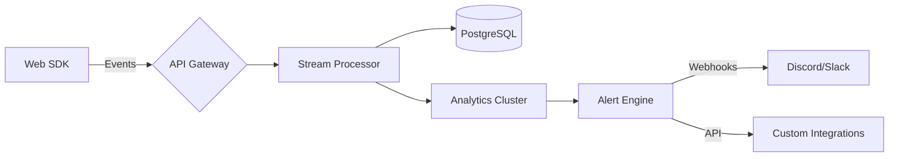

<div align="center">
  <h1 align="center">KittyAt — Real-Time Web Application Monitoring</h1>
  
  
  <p align="center">
    <a href="https://opensource.org/licenses/MIT">
      
    </a>
    <a href="CHANGELOG.md">
      
    </a>
    <a href="https://discord.gg/your-invite-link">
      
    </a>
  </p>
</div>

---
<p align="center">
  <em>Next-gen monitoring solution with laser-focused insights</em> 🔍
</p>

<div align="center">
  
</div>

---

##  **Feature **

### **Real-Time Alert System**
| Feature               | Description               | Status       |
|-----------------------|---------------------------|--------------|
| 📢 Discord Integration | Instant notifications     | Live ✅      |
| 🎚 Threshold Control  | Custom alert triggers     | Live ✅      |


## 🚀 **Quick Start**

### 📥 Installation
```bash
git clone https://github.com/0Shadow02/KittyAt.git
cd KittyAt
```
```bash
bun install
```
### 🖥️ Development Mode
```bash
bun run dev
```

### 🏗️ Production Build
```bash
bun run build && bun start
```


## **Code Showcase**

###  E-commerce Tracking
```
await fetch("http://kittyAt.me/api/v1/events", {
        method: "POST",
        body: JSON.stringify({
          category: "sale",
          fields: {
            plan: "PRO",
            email: "Shadow@email.com",
            amount: 299.00,
            currency: "USD",
            transactionId: "1234567890",
            date: "2023-10-01T12:34:56Z",
            customer: {
              firstName: "Shadow",
              address: {
                street: "123 Main Akihabara",
                city: "Tokyo",
                state: "Japan",
                zip: "12345"
              }
            }
          }
        }),
        headers: {
          "Content-Type": "application/json",
          Authorization: "Bearer <YOUR_API_KEY>"
        }
      })
```
---

> **– Shadow, Lead Developer** 

<div align="center">
  
</div>

---

## **Contribution **

### First Steps
1. [Find Good First Issues](https://github.com/0Shadow02/KittyAt/issues?q=is%3Aopen+is%3Aissue+label%3A%22good+first+issue%22)
2. Fork & Clone Repository
3. Install Dependencies:
   ```bash
   bun install && bun run dev
   ```

###  Branch Strategy
```bash
feat/    → New features
fix/     → Bug repairs
docs/    → Documentation
chore/   → Maintenance
```

---

## 🔒 **Security & Ethics**
- **MIT Licensed** - Free Forever for All Uses
- **Privacy First Architecture** - All processing happens locally 🔐
- **GDPR Compliant** - By design, from day one 🌍

---

<div align="center">
  <h3> System Architecture</h3>
  <details>
    <summary>Click to Reveal Blueprint</summary>
    

  </details>

---

## 📜 **License & Ethics**

**MIT License** — Free for personal and commercial use.  
🌱 We enforce a **strict no-tracking policy** — your analytics data never leaves your infrastructure.

---

<div align="center">

[](https://twitter.com/Shadow992791168)  
📮 **Need Help?**  
Open an issue or DM [@ShadowDev](https://twitter.com/Shadow992791168)

</div>

---

*Made with ❤️ for Developers*  

---

